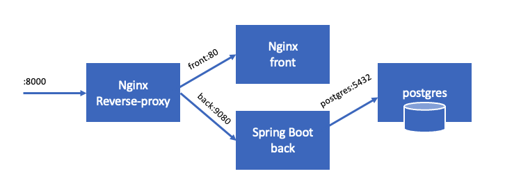

# Docker workshop

Simple exercise to combine some services on containers:
- database
- backend Java Spring Boot
- frontend HTML on nginx + Ajax call
- reverse proxy with nginx




Build each container on every sub-folder (more info in each README.md)

You can start each service on their own or with the provided `docker-compose.yaml` file

To run the database you can just execute:

```
docker run --name postgres -e POSTGRES_PASSWORD=postgres -d postgres:10
```

to run in kubernetes

Run postgres and expose on a service
```
kubectl run --image postgres:10 postgres --env POSTGRES_PASSWORD=postgres

kubectl expose pod postgres --port 5432 --target-port 5432
```

Run back 
```
cd back
kubectl apply -f back-deployment.yaml
kubectl apply -f back-service.yaml
```

Run front 
```
cd front
kubectl apply -f front-deployment.yaml
kubectl apply -f front-service.yaml
```

Run proxy 
```
cd proxy
kubectl apply -f proxy-deployment.yaml
kubectl apply -f proxy-service.yaml
```

To access, run a port-forward on proxy pod.
First get the pod name
```
kubectl get pods
kubectl port-forward proxy-xxxx-yyyy 8080:80
```
 
You should get the both the `index.html` and the `/api/` call
```
curl http://localhost:8080
curl http://localhost:8080/api/
```


